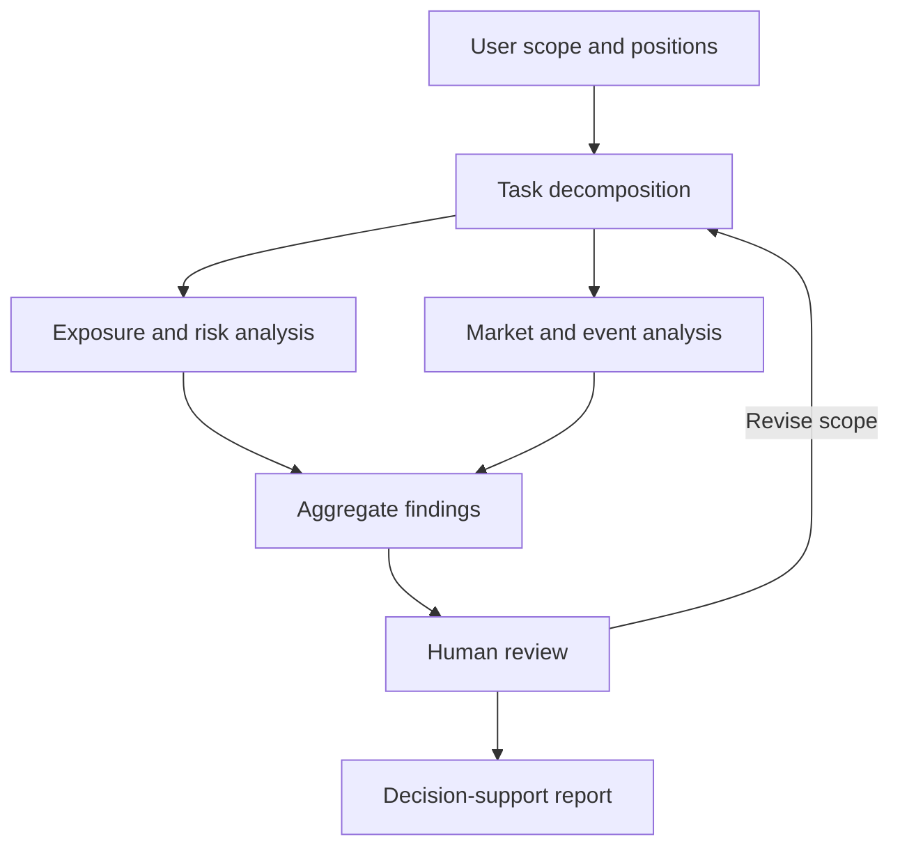

# ReAct-based collaborative financial hedging decision support

It describes how reasoning, financial tools and collaborative research are organised around FX risk assessment. Backend implementation and training code are outside this release.

## Data and analytical inputs

| Input | Analytical role |
| --- | --- |
| Tonghuashun iFinD market data | Real-time and intraday FX monitoring, with historical market context |
| Position information | Currency exposures, position sizes, weights and risk inputs |
| Financial-event text | Semantic features, relevance, sentiment and estimated volatility impact |
| Historical shock references | Context for event analysis and scenario construction |
| User preferences | Research scope, risk preferences and review priorities |

Market-data timestamps and explicit scenario assumptions are important context for interpreting the resulting analysis. High-frequency data access does not itself imply high-frequency trade execution.

## ReAct analysis loop

The design uses an iterative **reasoning → action → observation** workflow:

1. Interpret the user's positions and financial question.
2. Identify the information or calculation needed for the assessment.
3. Call a predefined analytical tool, such as a position-risk, volatility or sentiment tool.
4. Observe the result and decide whether more information is needed.
5. Consolidate the assessment and hedging considerations for human review.

The language model coordinates analysis and explains outputs; numerical results come from the relevant analytical tools. Tool outputs and assumptions provide the basis for review.

## Multi-agent research design

Section 4.2.8 extends the workflow through subtopic-based collaboration:

The diagram is a conceptual grouping of the documented design, not an execution trace.

- **Subtopic decomposition:** break the research question into focused analyses and assign specialised agent roles.
- **Parallel research:** analyse different topics independently before combining results through a Map-Reduce style aggregation workflow.
- **Iterative questioning:** use simulated interviews between AI roles to explore topics through multiple rounds. These are AI interactions, not external expert endorsements.
- **Human participation:** let the user adjust the research topics, scope and direction before or during analysis.
- **Context management:** use LangGraph subgraphs and shared state to carry information between related analysis steps.

## Framework responsibilities

| Layer | Technology in the design | Responsibility |
| --- | --- | --- |
| Analytical coordination | ReAct | Select tools, interpret observations and determine the next analysis step |
| Workflow state | LangGraph | Represent tasks as nodes, route conditionally, manage loops and subgraphs |
| Reusable components | LangChain | Connect models, prompt templates, tools and structured output parsing |
| Observability | LangSmith | Trace calls and inspect errors, latency and workflow behaviour |
| User interface | React, ECharts | Present market information, risk signals and decision-support outputs |

LangSmith is included here as a component of the documented architecture. Workflow tracing is distinct from financial-model validation or a guarantee of regulatory compliance.

## Financial-text signal design

The event module combines a financial-text representation with relevance and market-impact features:

- **Text representation:** a FinBERT-based encoder, with a LoRA adapter-loading path, produces semantic features.
- **Event relevance:** a model output scores relevance as an additional feature.
- **Market interpretation:** an LLM produces sentiment and estimated volatility-impact scores from the news text.
- **Feature combination:** downstream components combine the representations and scores to produce currency-pair, direction and confidence-score outputs.

These outputs support event interpretation and risk prioritisation. A text-derived impact score is not a realised-volatility estimate, and a confidence score is not automatically a calibrated event probability.

## Decision-support output

The business-facing result brings together the positions under review, relevant events, tool-derived risk information, scenario assumptions and hedging considerations. Human review remains part of the workflow before any financial action.
